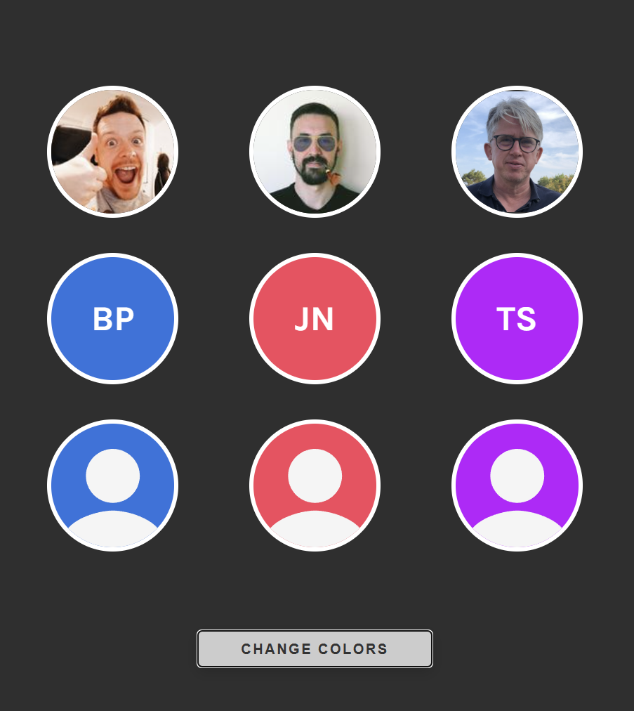

# Avatar Component

## Description
This is an avatar made as a reusable React Component which can appear in the following three different versions, depending on which props are provided to it:

- With an image
- With initials
- Anonymous, with a user icon from IoPersonSharp in the `react-icons` library.

In this version of the component the "initials version" is hard-coded to red color, and the color of the "Anonymous version" is randomized.
  
 

## Technologies
- HTML
- CSS
- JavaScript
- React

## Live link
The site is deployed here:
[https://toms-avatar.netlify.app](https://toms-avatar.netlify.app)

Please feel free to visit the site!
